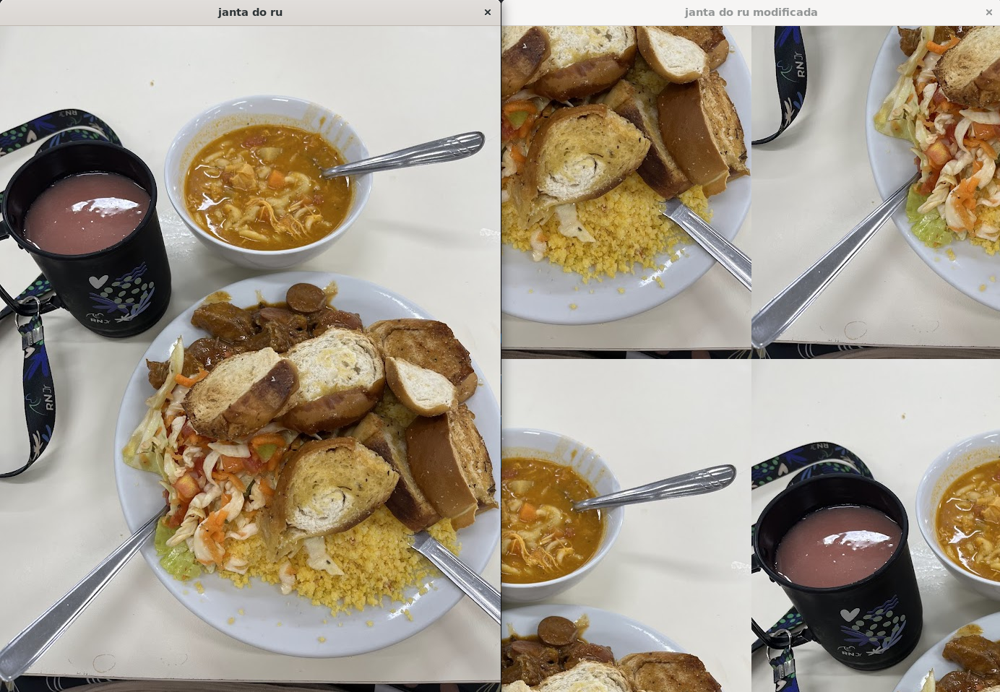

# pdi
Repositório destinado a disciplina DCA0445 - Processamento Digital de Imagens
## Unidade 1
Nesta seção será apresentada as resoluções de alguns dos exericícios práticos.

### Exercício 2.1
> Enunciado da questão:  Utilizando o programa da Listagem 4 como referência, implemente um programa regions.cpp. Esse programa deverá solicitar ao usuário as coordenadas de dois pontos P1 e P2 localizados dentro dos limites do tamanho da imagem e exibir que lhe for fornecida. Entretanto, a região definida pelo retângulo de vértices opostos definidos pelos pontos P1 e P2
 será exibida com o negativo da imagem na região correspondente. O efeito é ilustrado na Figura 4.

 Em suma, dada uma imagem, o usuário deve digitar as coordendas de dois pontos, e estes serão utilizados para delimitar um retângulo. Tudo o que estiver dentro do retângulo da imagem será aplicado o efeito de negativo nas cores. Bem como mostra a imagem abaixo, na qual o primeiro ponto tem coordenadas ```(100,100)``` e o segundo ponto tem coordenadas ```(500,500)```, ou seja, a imagem ficara negativa dentro do retângulo de vértices ```(100,100)```, ```(100,500)```, ```(500,100)``` e ```(500,500)```:

 

O código desenvolvido para a resolução deste exercício pode ser visto [aqui](./pdiTrabalhoU1/exercicio2.1/exercicio.cpp), e as imagens geradas estão [nesta pasta](./pdiTrabalhoU1/exercicio2.1/) (são as imagens "luffy", que é a imagem original e a imagem "luffyNegative", que é a imagem com o efeito negativo).
 
### Exercício 2.1
> Utilizando o programa da Listagem 4 como referência, implemente um programa trocaregioes.cpp. Seu programa deverá trocar os quadrantes em diagonal na imagem. Explore o uso da classe cv::Mat e seus construtores para criar as regiões que serão trocadas. O efeito é ilustrado na Figura 5. Assuma que a imagem de entrada tem dimensões múltiplas de 2 para facilitar a implementação do processo de troca.

Em suma, dada uma imagem, ela deverá ser particionada em 4 sub-imagens, uma para o canto superior esquerdo, outra para o canto superior direito, outra para o inferior direito, e outra para o inferior esquerdo. Após isso, deve-se gerar outra imagem na qual o canto inferior esquerdo passa a ser o canto superior direito da nova imagem, o canto inferior direito passa a ser o canto superior esquerdo da nova imagem, o canto superior direito passa a ser o canto inferior esquerdo da nova imagem e superior esquerdo passa a ser o canto inferior direito da nova imagem.

Abaixo está uma imagem processada com o código que pode ser visto [aqui](./pdiTrabalhoU1/exercicio2.2/exercicio.cpp): 



### Exercício 3.1
> Utilizando o programa-exemplo filestorage.cpp como base, crie um programa que gere uma imagem de dimensões 256x256 pixels contendo uma senóide de 4 períodos com amplitude igual 127 desenhada na horizontal, semelhante àquela apresentada na Figura 6. Grave a imagem no formato YML e também exporte no formato PNG, como faz o programa-exemplo. Compare os arquivos gerados, extraindo uma linha correspondente de cada imagem gravada e comparando a diferença entre elas. Trace um gráfico da diferença calculada ao longo da linha correspondente extraída nas imagens. O que você observa? Por que isso acontece?

Em suma, deve-se gerar uma senóide de amplitude 127 com 4 períodos, outra com 8, e deppois fazer uma subtração dessas senoides e mostrar todas as imagens. Elas podem ser vistas logo abaixo:

  

Também foram geradas, para cada senoide, um arquivo ```.yml```. O código deste exercício pode ser encontrado [aqui](./pdiTrabalhoU1/exercicio3.1/exercicio.cpp).

### Exercício 4.1
> 

