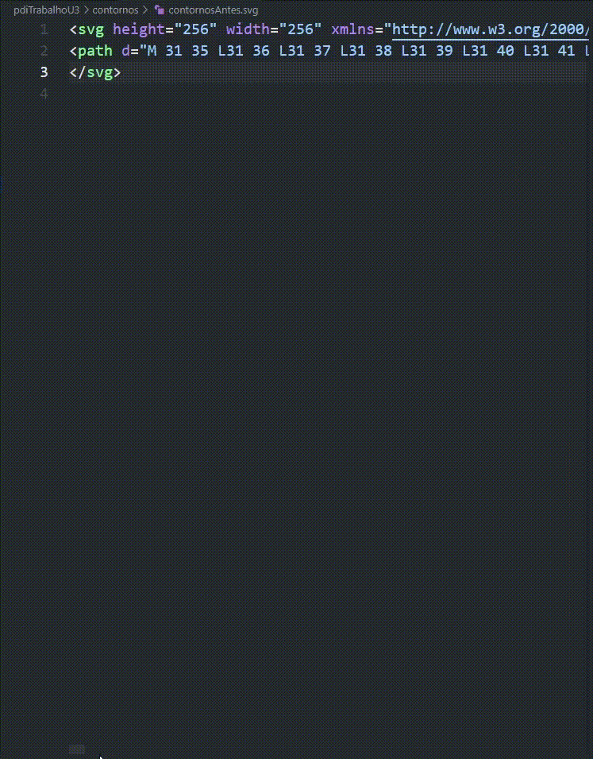
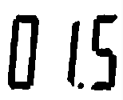
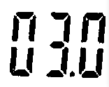

# DCA0445 - Processamento Digital de Imagens
Repositório destinado a resoluções de alguns exercícios da disciplina DCA0445 - Processamento Digital de Imagens do curso de Engenharia de Computação da UFRN.

> Aluno: Pedro Leandro Batista Marques - 20220080427

>Navegue pelo repositório clicando nos links:
[```Unidade 1```](#unidade-1) [```Unidade 2```](#unidade-2) [```Unidade 3```](#unidade-3)

## Unidade 1
Nesta seção será apresentada as resoluções de alguns dos exericícios práticos da unidade 1.

### Exercício 2.1
> Utilizando o programa da Listagem 4 como referência, implemente um programa regions.cpp. Esse programa deverá solicitar ao usuário as coordenadas de dois pontos P1 e P2 localizados dentro dos limites do tamanho da imagem e exibir que lhe for fornecida. Entretanto, a região definida pelo retângulo de vértices opostos definidos pelos pontos P1 e P2
 será exibida com o negativo da imagem na região correspondente. O efeito é ilustrado na Figura 4.

 Em suma, dada uma imagem, o usuário deve digitar as coordendas de dois pontos, e estes serão utilizados para delimitar um retângulo. Tudo o que estiver dentro do retângulo da imagem será aplicado o efeito de negativo nas cores. Bem como mostra a imagem abaixo, na qual o primeiro ponto tem coordenadas ```(100,100)``` e o segundo ponto tem coordenadas ```(500,500)```, ou seja, a imagem ficara negativa dentro do retângulo de vértices ```(100,100)```, ```(100,500)```, ```(500,100)``` e ```(500,500)```:

 

O código desenvolvido para a resolução deste exercício pode ser visto [aqui](./pdiTrabalhoU1/exercicio2.1/exercicio.cpp), e as imagens geradas estão [nesta pasta](./pdiTrabalhoU1/exercicio2.1/) (são as imagens "luffy", que é a imagem original e a imagem "luffyNegative", que é a imagem com o efeito negativo).
 
### Exercício 2.1
> Utilizando o programa da Listagem 4 como referência, implemente um programa trocaregioes.cpp. Seu programa deverá trocar os quadrantes em diagonal na imagem. Explore o uso da classe cv::Mat e seus construtores para criar as regiões que serão trocadas. O efeito é ilustrado na Figura 5. Assuma que a imagem de entrada tem dimensões múltiplas de 2 para facilitar a implementação do processo de troca.

Em suma, dada uma imagem, ela deverá ser particionada em 4 sub-imagens, uma para o canto superior esquerdo, outra para o canto superior direito, outra para o inferior direito, e outra para o inferior esquerdo. Após isso, deve-se gerar outra imagem na qual o canto inferior esquerdo passa a ser o canto superior direito da nova imagem, o canto inferior direito passa a ser o canto superior esquerdo da nova imagem, o canto superior direito passa a ser o canto inferior esquerdo da nova imagem e superior esquerdo passa a ser o canto inferior direito da nova imagem.

Abaixo está uma imagem processada com o código que pode ser visto [aqui](./pdiTrabalhoU1/exercicio2.2/exercicio.cpp): 


### Exercício 3.1
> Utilizando o programa-exemplo filestorage.cpp como base, crie um programa que gere uma imagem de dimensões 256x256 pixels contendo uma senóide de 4 períodos com amplitude igual 127 desenhada na horizontal, semelhante àquela apresentada na Figura 6. Grave a imagem no formato YML e também exporte no formato PNG, como faz o programa-exemplo. Compare os arquivos gerados, extraindo uma linha correspondente de cada imagem gravada e comparando a diferença entre elas. Trace um gráfico da diferença calculada ao longo da linha correspondente extraída nas imagens. O que você observa? Por que isso acontece?

Em suma, deve-se gerar uma senóide de amplitude 127 com 4 períodos, outra com 8, e deppois fazer uma subtração dessas senoides e mostrar todas as imagens. Elas podem ser vistas logo abaixo:

  

Também foram geradas, para cada senoide, um arquivo ```.yml```. O código deste exercício pode ser encontrado [aqui](./pdiTrabalhoU1/exercicio3.1/exercicio.cpp).

### Exercício 4.1
> Usando o programa bitplanes.cpp como referência para esteganografia, escreva um programa que recupere a imagem codificada de uma imagem resultante de esteganografia. Lembre-se que os bits menos significativos dos pixels da imagem fornecida deverão compor os bits mais significativos dos pixels da imagem recuperada. O programa deve receber como parâmetros de linha de comando o nome da imagem resultante da esteganografia. Teste a sua implementação com a imagem da Figura 13 (desafio-esteganografia.png).

A imagem original é:


Ao subtrair ```um``` plano de bits, a imagem resutante é:


Ao subtrair ```dois``` planos de bits, a imagem resutante é:


Ao subtrair ```três``` planos de bits, a imagem resutante é:


```Três``` planos de bits é foi a melhor quantidade de planos de bits para subtrair e obter a imagem mais nítida.

O código para a resolução deste exercício pode ser encontrado [aqui](./pdiTrabalhoU1/exercicio4.1/exercicio.cpp).

[```Voltar para o começo```](#dca0445---processamento-digital-de-imagens)

## Unidade 2

Nesta seção será apresentada as resoluções de alguns dos exericícios práticos da unidade 2.

### Exercícios do capítulo 15 (A Tranformada Discreta de Fourier)
> Utilizando os programa exemplos/dft.cpp, calcule e apresente o espectro de magnitude da imagem Figura 40, “Imagem senoidal com 256x256 pixels”. 

A imagem original é uma senoide com 256x256 pixels: 


Os espectros de fase e magnitude da senoide é:
 


O código para a resolução desta parte do exercício pode ser encontrado [aqui](./pdiTrabalhoU2/DFT/exercicio.cpp).

> Usando agora o filestorage.cpp, mostrado na Listagem 15, “filestorage.cpp” como referência, adapte o programa exemplos/dft.cpp para ler a imagem em ponto flutuante armazenada no arquivo YAML equivalente (ilustrado na Listagem 18, “trecho do arquivo senoide-256.yml”).

Os espectros de magnitude e fase da senoide YML está logo abaixo:


O código para a resolução desta parte do exercício pode ser encontrado [aqui](./pdiTrabalhoU2/DFT/exercicio2.cpp).

> Compare o novo espectro de magnitude gerado com o valor teórico da transformada de Fourier da senóide. O que mudou para que o espectro de magnitude gerado agora esteja mais próximo do valor teórico? Porque isso aconteceu?

```Resposta:``` o espectro de magnitude gerado pela transformada de fourier da imagem em .yml é mais próximo do valor teórico da transformada de fourier uma senoide 256x256 pura. Isso acontece porque o arquivo senoide-256.yml armazena as informações com pontos flutuantes, e essas casas extras de representação da imagem a tornam uma imagem mais próxima de uma senoide pura/teórica.

### Exercícios do capítulo 18 (Quantização vetorial com k-means)

> Utilizando o programa kmeans.cpp como exemplo prepare um programa exemplo onde a execução do código se dê usando o parâmetro nRodadas=1 e inciar os centros de forma aleatória usando o parâmetro KMEANS_RANDOM_CENTERS ao invés de KMEANS_PP_CENTERS. Realize 10 rodadas diferentes do algoritmo e compare as imagens produzidas. Explique porque elas podem diferir tanto.

A imagem original é esta:


Abaixo, seguem as imagens com n execuções do k-means:


```1 execução do k-means```


```2 execução do k-means```


```3 execução do k-means```


```4 execução do k-means```


```5 execução do k-means```


```6 execução do k-means```


```7 execução do k-means```


```8 execução do k-means```


```9 execução do k-means```


```10 execução do k-means```

A diferença nas imagens se dá devido aos diferentes centros inicializados do k-means, pois o k-means define as cores da imagem final a partir desto centro inicializado. Portanto, gerando centros de forma aleatória, as cores da imagem final também mudam aleatoriamente, o que implica que as imagens resultante, variam, mesmo que minimamente a cada nova execução.

O código para a resolução desta parte do exercício pode ser encontrado [aqui](./pdiTrabalhoU2/k-means/exercicio.cpp).

[```Voltar para o começo```](#dca0445---processamento-digital-de-imagens)

## Unidade 3

Nesta seção será apresentada as resoluções de alguns dos exericícios práticos da unidade 3.

### Exercícios do capítulo 21 (Extração de contornos)

> Utilizando o programa contornos.cpp como referência, aplique-o na extração do contorno da imagem retangulos.png mostrada na Figura 55, “Retângulos superpostos”. Quantos pontos são gerados para o contorno dos retângulos?

Ao executar o programa contornos.cpp, foram gerados ```745 pontos``` para o contorno dos retângulos.


Abaixo segue a imagem do arquivo .svg gerado ao executar o programa, bem como a abertura da imagem com os contornos detectados.


> Modifique o programa para extrair os contornos internos das componentes conectadas presentes na imagem formas.png. Para isso, altere o parâmetro cv::CHAIN_APPROX_NONE para cv::CHAIN_APPROX_SIMPLE na função findContours(). O que acontece com os novos contornos extraídos? Mostre quantos pontos são gerados após a alteração e discuta como a modificação do parâmetro cv::CHAIN_APPROX_SIMPLE influencia na extração do contorno.

Com a alteração deste parâmetro, agora, o total de pontos encontrado para o contorno foi de ```745 para apenas 9```:


Com o método ```cv::CHAIN_APPROX_NONE```, todos os pontos dos contornos são armazenados, sem qualquer tipo de compressão, logo, todos os pontos de fronteira são armazenados. Tanto é que o ```[arquivo .csv gerado](./pdiTrabalhoU3/contornos/contornosAntes.svg)``` tem inúmeros parâmetros para determianar as bordas, como é visível no gif abaixo:



Com o método ```cv::CHAIN_APPROX_SIMPLE```, os segmentos verticais, horizontais e diagonais (*os serrilhados da imagem*) são comprimidos, daí são armazenados apenas os pontos finais desses segmentos. Isso reduz drasticamente a quantidade de memória necessária para representar os contornos. No nosso caso, ```não houve perdas visíveis a olho nu``` de perca de informação dos contornos. Como pode-se ver no gif abaixo, o ```[arquivo .csv gerado](./pdiTrabalhoU3/contornos/contornosDepois.svg)``` com a compressão é MUITO menor do que o arquivo sem compressão.


O código desenvolvido para a resolução deste exercício pode ser visto [aqui](./pdiTrabalhoU3/contornos/contornos.cpp).

### Exercícios do Capítulo 22 (Extração de características: Momentos de Hu para regiões)

> Utilizando o programa momentos-regioes.cpp como referência utilize as imagens pessoa.jpg e multidao.jpg e descubra em que posição a pessoa da primeira imagem se encontra na segunda imagem. Caso o programa fique lento, verifique se é possível utilizar a função cv::resize() para redimensionar as imagens e tornar o processamento mais rápido. Discuta as dificuldades encontradas na resolução do problema.

### Exercícios do capítulo 24 (Filtragem de forma com morfologia matemática)

> Um sistema de captura de imagens precisa realizar o reconhecimento de carateres de um visor de segmentos para uma aplicação industrial. O visor mostra caracteres como estes apresentados na Figura 60, “Caracteres do visor”.


> Ocorre que o software de reconhecimento de padrões apresenta dificuldades de reconhecer os dígitos em virtude da separação existente entre os segmentos do visor. Idealmente, o software deveria reconhecer os dígitos como na Figura 61, “Caracteres ideais para o reconhecimento”.


> Usando o programa morfologia.cpp como referência, crie um programa que resolva o problema da pré-filtragem de forma para reconhecimento dos caracteres usando operações morfológicas. Você poderá usar as imagens digitos-1.png, digitos-2.png, digitos-3.png, digitos-4.png e digitos-5.png para testar seu programa. Cuidado para deixar o ponto decimal separado dos demais dígitos para evitar um reconhecimento errado do número no visor.

Para resolver este problema, utiliza-se a operação de ```fechamento morfológico```, que consiste em aplicar a operação de ```dilatação``` seguida de uma ```erosão``` na imagens, na qual, o elemento estruturante é um retângulo que consegue unir as descontinuidades dos números dos displays. Porém, as operações morfológicas do opencv funcionam em elementos da cor branca, então, primeiro faz-se o negativo das imagens para só então aplicar as operações morfológicas na imagem. Por fim, faz-se novamente o negativo das imagens para que a cor dos dígitos voltem a cor original.

Imagens originais vs imagens após o fechamento morfológico:

  

  

  

  

  

O código desenvolvido para a resolução deste exercício pode ser visto [aqui](./pdiTrabalhoU3/morfologia/morfologia.cpp).
 
[```Voltar para o começo```](#dca0445---processamento-digital-de-imagens)